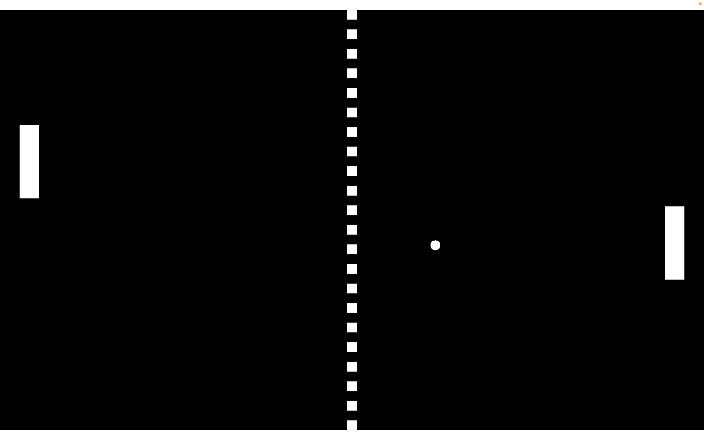

# 🎾 Pong Game
A simple two-player Pong clone built with C and SDL2.

## Prerequisites 
Make sure you have [SDL2](https://www.libsdl.org/) installed on your system.

## Controls 
| Player | Move Up | Move Down |
|--------|---------|-----------|
| P1     | `W`     | `S`       |
| P2     | `↑`     | `↓`       |

## Future Optimizations
- Resizable window
- Allowing the ball to move at various angles
- Changing ball speed
